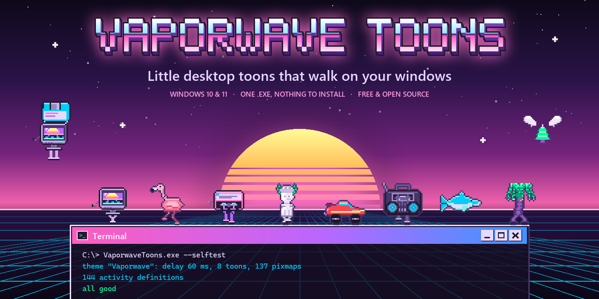
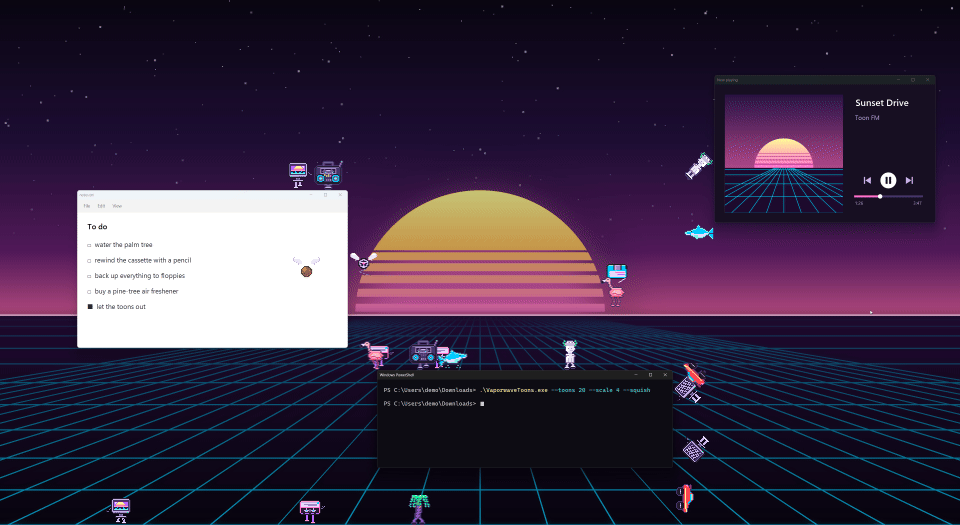
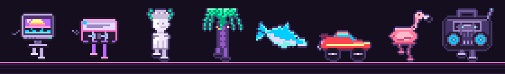

<p align="center">
  
</p>

<p align="center">
  <a href="LICENSE"></a>
  
  
  
  <a href="https://github.com/ghbanck/Vaporwave-Toons/actions/workflows/build.yml"></a>
  <a href="https://github.com/ghbanck/Vaporwave-Toons/releases/latest"></a>
</p>

<p align="center"><a href="README.md">English</a> · <b>Português</b></p>

O Vaporwave Toons traz o tema **Vaporwave** do [XPenguins](https://xpenguins.seul.org/) para o
Windows 10 e 11. Oito toons caem no seu desktop, andam e correm sobre as barras de título,
escalam as bordas das janelas, despencam das beiradas e descem de paraquedas num disquete de
3,5". Arraste uma janela por cima deles e eles são esmagados; aí cada um manda para o céu a
parte de si que tem alma. O carro manda o cheirinho de pinheiro.

É um `.exe` pequeno e único: sem instalador, sem runtime para baixar, nada rodando como
administrador.

<p align="center">
  
  <br>
  <a href="docs/demo.mp4"><b>▶ Assista à demonstração completa</b></a> (57 segundos, MP4)
</p>

## Os toons

<p align="center"></p>

Um terminal CRT, uma fita cassete, uma estátua grega, uma palmeira, um golfinho, um carro anos
80, um flamingo e um boombox. Cada um tem as 18 atividades que o XPenguins conhece: andar,
correr, cair, rodopiar, escalar, flutuar, seis ações paradas, quatro jeitos de morrer, um anjo e
uma animação de desligar para quando você sai.

## Baixar e usar

1. Baixe o `VaporwaveToons.exe` da [última versão](https://github.com/ghbanck/Vaporwave-Toons/releases/latest).
2. Dê dois cliques.

Só isso. Ele usa o .NET Framework 4.8, que faz parte do Windows 11 e do Windows 10 desde a versão
1903. Na primeira vez o SmartScreen pode avisar sobre um editor desconhecido, porque o
executável não tem assinatura digital; clique em **Mais informações › Executar assim mesmo**,
ou compile você mesmo a partir do código.

Um ícone de monitor CRT aparece na área de notificação, perto do relógio (no Windows 11 ele pode
ficar escondido na setinha `^`). O botão direito abre o menu:

| Opção | O que faz |
|---|---|
| Pausar / Ocultar | Congela ou esconde os toons. Dois cliques no ícone também pausam. |
| Quantidade | De 4 a 48. O padrão do tema é 18. |
| Toons | Quais dos oito aparecem. |
| Tamanho | De 1× a 4×. O automático usa 2× numa tela 4K. |
| Velocidade | Lenta, normal, rápida ou turbo. |
| Idioma | English ou Português. O automático segue o idioma do Windows. |
| Clicar num toon elimina ele | O toon clicado leva um *zap*, e o cursor vira uma mira sobre os toons. |
| Mortes mansas | Toda morte vira a explosão colorida do tema. |
| Anjos sobem ao céu | Desligado, os toons só somem. |
| Andar na frente de janelas maximizadas e encaixadas | Veja abaixo. |
| Esconder em tela cheia | Some com os toons em jogos, vídeos e apresentações. |
| Iniciar com o Windows | Abre o programa quando você entra no Windows. |
| Sair | Cada toon "desliga" como um CRT e o programa fecha. |

Os cliques atravessam os toons, a não ser com o modo *zap* ligado. As preferências ficam em
`%APPDATA%\VaporwaveToons\settings.ini`. Para desinstalar, desmarque *Iniciar com o Windows*,
clique em *Sair* e apague o `.exe` e essa pasta.

## O que muda em relação ao XPenguins no Linux

- **Janelas maximizadas e encaixadas viram fundo.** No XPenguins toda janela é um bloco sólido.
  No Windows é comum deixar janelas maximizadas ou lado a lado, e com elas sólidas não sobraria
  espaço; então os toons passam na frente delas e andam sobre a barra de tarefas. Janelas
  flutuantes continuam sendo chão e parede. Dá para desligar no menu.
- **Só esmaga a janela que se move.** Arrastar ou redimensionar uma janela por cima de um toon o
  esmaga. Uma janela que apenas aparece em cima dele (aberta, restaurada, desencaixada) deixa ele
  sair andando.
- **Carona.** Quem está em cima de uma janela, ou pendurado na lateral, vai junto quando ela se
  move.
- **Gravidade.** Quem cai acelera até a velocidade terminal do tema. Com a velocidade fixa do
  original, cair numa tela 4K levava uns vinte segundos.
- **O paraquedas desce**, como o desenho do disquete sugere.
- **Espelhamento.** Animações de uma direção só (ações paradas, quedas, mortes) são espelhadas
  quando o toon está virado para a esquerda, para ele não virar de repente ao parar.
- **Vários monitores, DPI e áreas de trabalho virtuais.** Tudo em pixels físicos, com DPI por
  monitor; a faixa entre monitores de alturas diferentes vira parede; e os toons acompanham a
  troca de área de trabalho virtual (Win+Ctrl+setas).

## Linha de comando

```text
VaporwaveToons.exe --toons 30 --scale 3
VaporwaveToons.exe --theme C:\caminho\OutroTemaDoXPenguins
VaporwaveToons.exe --lang en
VaporwaveToons.exe --selftest --log teste.txt            valida o tema e sai
VaporwaveToons.exe --list-windows --log janelas.txt      quais janelas contam como sólidas, e por quê
VaporwaveToons.exe --help
```

As opções da linha de comando valem só para aquela execução. `--theme` carrega qualquer tema
do XPenguins: uma pasta com um arquivo `config` e os sprites `.xpm`.

## Compilar

Precisa do [.NET SDK](https://dotnet.microsoft.com/download) 8 ou mais recente. Se o *targeting
pack* do .NET Framework 4.8 não estiver instalado, os assemblies de referência vêm do NuGet
automaticamente.

```text
dotnet build -c Release
```

O resultado é `bin\Release\net48\VaporwaveToons.exe`, um arquivo só com o tema embutido. O
`--selftest` do tema Vaporwave deve dar 8 toons, 137 pixmaps, 144 definições de atividade e
"all good".

Outras ferramentas, todas opcionais:

| Comando | O que faz |
|---|---|
| `pwsh tools/package.ps1` | Compila, roda o autoteste e grava os arquivos da release em `dist\`. |
| `python tools/make_icon.py` | Refaz o `assets/vaporwave.ico` a partir do CRT do tema (precisa do Pillow). |
| `python tools/make_hero.py` | Refaz a imagem do topo do README, `docs/hero.png` (precisa do Pillow e das fontes do Windows). |

## Como funciona

| Arquivo | Papel |
|---|---|
| `src/Program.cs` | Entrada, instância única, `--selftest`, `--list-windows`. |
| `src/Theme.cs` | Lê o `config` do tema (a mesma gramática do XPenguins) e monta as sprite sheets. |
| `src/Xpm.cs` | Leitor de XPM3. |
| `src/World.cs` | Monitores, janelas e colisão: o que é chão, parede e céu. |
| `src/Engine.cs` | A máquina de estados dos toons: andar, cair, escalar, morrer… |
| `src/ToonWindow.cs` | Uma janela *layered* transparente por toon (`UpdateLayeredWindow`). |
| `src/TrayApp.cs` | Ícone e menu da área de notificação, timer dos quadros. |
| `src/Strings.cs` | Todo texto que o usuário lê, em inglês e português. |
| `src/Settings.cs` | Preferências em `%APPDATA%\VaporwaveToons\settings.ini`. |
| `src/VirtualDesktops.cs` | Acompanha a troca de área de trabalho virtual. |
| `theme/` | O tema Vaporwave, embutido no `.exe` como zip no build. |

**O mundo.** O espaço livre é a área de trabalho de cada monitor (a tela sem a barra de
tarefas) mais uma faixa de "céu" acima dela, onde os toons nascem e de onde caem. Tudo fora disso
é sólido, como a janela raiz do X para o XPenguins. Cada janela visível de verdade (não
minimizada, não oculta pelo gerenciador de janelas, não popup, tooltip ou overlay) é um retângulo
sólido, medido pelos limites visíveis da moldura, sem a borda invisível do Windows 10 e 11.

## Contribuir

Issues e pull requests são bem-vindos. Algumas regras da casa:

- O programa continua sendo um `.exe` único e sem dependências, no .NET Framework 4.8.
- Texto que o usuário lê fica em `src/Strings.cs`, nos dois idiomas. Comentários e diagnósticos
  ficam em inglês.
- Rode o `--selftest` depois de mexer no carregador do tema, e o `--list-windows` depois de mexer
  em `src/World.cs`, num desktop com janelas flutuantes, maximizadas e encaixadas.

## Créditos e licença

- Código: [MIT](LICENSE) © 2026 Gustavo Banck.
- O tema Vaporwave, em `theme/`, foi feito para Arthur e liberado sob
  [CC0 1.0](https://creativecommons.org/publicdomain/zero/1.0/deed.pt-br) (domínio público).
- O [XPenguins](https://xpenguins.seul.org/) é de Robin Hogan. Este projeto reimplementa o
  comportamento dele e não contém nenhum código dele.

Detalhes em [THIRD-PARTY-NOTICES.md](THIRD-PARTY-NOTICES.md).
